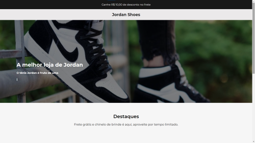

# Jordan-Shoes
Desafio proposto no servidor do discord, Codelandia

<h1 align="center">
  
</h1>

# Tecnologias utilizadas

- Html
- Css
- Javascript (Bibliotecas: scollreveal e typed.js)

# Clone este repositório

 - Abra o terminal da sua ide
 - Digite: git clone https://github.com/MarceloCChaves/Desafio-Codel-ndia-01.git

# Autor
---

<a href="https://github.com/MarceloCChaves">
 
  
 <b>Marcelo Chaves</b></a> <a href="https://avatars.githubusercontent.com/u/62251064?s=400&u=b1c8da11d91445ccb2d97b709ccbcd0524885d98&v=4" title="Marcelo">🚀</a>

Feito com ❤️ por Marcelo Chaves 👋🏽 Entre em contato!

 

